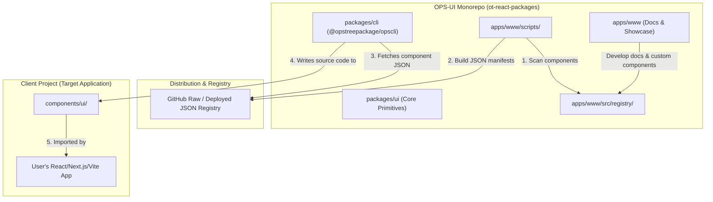

# OPS-UI Ecosystem Explainer Guide

This document is designed to help you easily explain what you are building, how the CLI works, and how to consume or contribute components to this ecosystem.

---

## 1. What Are We Building?

**OPS-UI** is a developer-centric, custom UI component ecosystem tailored for React applications. 

Unlike traditional UI libraries (e.g., Material UI, Chakra UI) that package components into opaque npm dependencies, OPS-UI uses a **distribution-by-code** approach (similar to `shadcn/ui`). 

### Core Concept: Ownership of Code
- **No Heavy Dependencies:** Instead of importing components from a large pre-compiled library, the **CLI downloads the source code directly** into the user's project (`/components/ui`).
- **Full Customizability:** Once added, the component code is 100% owned by the application developer. They can change styling, logic, or behavior directly in their local files.
- **Tailwind CSS & Framer Motion:** Out of the box, components use Tailwind for utility-first styling and Framer Motion / GSAP for smooth micro-animations.

---

## 2. The Ecosystem Architecture

Our repository is built as a **Turborepo monorepo**, containing three major building blocks:



### Monorepo Packages Breakdown

1. **[apps/www](file:///c:/Users/Gourav%20singh/Desktop/ot-react-packages/apps/www)**: The documentation site and the **source of truth for the registry**. Custom components are built here, cataloged, and compiled into JSON manifests.
2. **[packages/cli](file:///c:/Users/Gourav%20singh/Desktop/ot-react-packages/packages/cli)**: The published CLI package (`@opstreepackage/opscli`). It acts as the pipeline that fetches components from the hosted registry and puts them into the user's local directory.
3. **[packages/ui](file:///c:/Users/Gourav%20singh/Desktop/ot-react-packages/packages/ui)**: A package containing core shared UI primitives (buttons, accordions, badges, etc.) that can also be distributed.

---

## 3. How the CLI Works Under the Hood

The CLI (`@opstreepackage/opscli`) performs two major operations: **Initialization** and **Component Addition**.

### Command A: `opscli init`
This command prepares a clean React project to receive OPS-UI components.

```
┌────────────────────────────────┐
│ 1. Detect Environment         │  Reads package.json, checks for TS, Tailwind,
│    & Framework                 │  and frameworks (Next.js, Vite, etc.)
└──────────────┬─────────────────┘
               │
               ▼
┌────────────────────────────────┐
│ 2. Create Target Folders       │  Creates components/ui, lib, hooks, utils,
│                                │  styles, and types directories
└──────────────┬─────────────────┘
               │
               ▼
┌────────────────────────────────┐
│ 3. Install Peer Dependencies   │  Runs 'npm install clsx tailwind-merge ...'
│                                │  to make sure peer requirements are met
└──────────────┬─────────────────┘
               │
               ▼
┌────────────────────────────────┐
│ 4. Configure Alias & Utilities │  - Writes components.json
│                                │  - Generates lib/utils.ts with a cn() helper
│                                │  - Updates tsconfig.json with path aliases
└────────────────────────────────┘
```

### Command B: `opscli add <component-name>`
This command downloads the component and integrates it into the project.

```
┌────────────────────────────────┐
│ 1. Read Project Configuration │  Reads components.json to identify where to
│                                │  place UI components (e.g. components/ui)
└──────────────┬─────────────────┘
               │
               ▼
┌────────────────────────────────┐
│ 2. Fetch Manifest from Registry│  Fetches JSON metadata from:
│                                │  https://.../registry/components/button.json
└──────────────┬─────────────────┘
               │
               ▼
┌────────────────────────────────┐
│ 3. Resolve Dependencies        │  - Installs required npm packages
│                                │  - Recursively fetches sub-component manifests
└──────────────┬─────────────────┘
               │
               ▼
┌────────────────────────────────┐
│ 4. Write Component Source      │  Extracts the raw code from the manifest
│                                │  and writes it directly to the local folder
└────────────────────────────────┘
```

---

## 4. How Users Add Components to Their Application

For an end-user building an application, using OPS-UI is simple and takes three quick steps.

### Step 1: Initialize the Project
Inside the root directory of the application, run:
```bash
# Initialize OPS-UI configuration
npx @opstreepackage/opscli@latest init
```
*This prompts the user to choose directories for components and utilities, generates a `components.json` configuration file, and sets up the custom `cn(...)` utility.*

### Step 2: Add Components
Install any desired component via the CLI:
```bash
# Add a single component
npx @opstreepackage/opscli@latest add button

# Add multiple components
npx @opstreepackage/opscli@latest add badge accordion

# Skip prompts and overwrite files automatically
npx @opstreepackage/opscli@latest add tabs -y -f
```

### Step 3: Import and Use
Once the command finishes, the component code is available locally in the project. Import it like any other local file:
```tsx
import { Button } from "@/components/ui/button"

export default function MyWidget() {
  return (
    <div className="flex gap-4">
      <Button variant="default">Save Changes</Button>
      <Button variant="outline">Cancel</Button>
    </div>
  )
}
```

---

## 5. How Developers Add New Components to the UI Library
Adding a new component to the OPS-UI registry so that it becomes available via the `opscli add` command is automated using our monorepo build pipeline.

### Step 1: Develop the Component
Create a new `.tsx` file in **[apps/www/src/components/docs/ts/](file:///c:/Users/Gourav%20singh/Desktop/ot-react-packages/apps/www/src/components/docs)** (e.g., `MyCard.tsx`).

Add standard JSDoc comments at the top of the file. The registry synchronization script will read these tags to auto-generate the description, title, and categories:
```tsx
/**
 * @name MyCard
 * @description A styled promotional card component with interactive hover states.
 * @category ui
 */
import React from "react"
import { cn } from "@/lib/utils"

export interface MyCardProps extends React.HTMLAttributes<HTMLDivElement> {
  title: string
  subtitle?: string
}

export const MyCard = React.forwardRef<HTMLDivElement, MyCardProps>(
  ({ className, title, subtitle, children, ...props }, ref) => {
    return (
      <div
        ref={ref}
        className={cn("rounded-lg border bg-card p-6 shadow-sm", className)}
        {...props}
      >
        <h3 className="font-semibold text-lg">{title}</h3>
        {subtitle && <p className="text-sm text-muted-foreground">{subtitle}</p>}
        <div className="mt-4">{children}</div>
      </div>
    )
  }
)
MyCard.displayName = "MyCard"
```

### Step 2: Synchronize the Registry
To tell the registry about the new component, run the synchronization script. This script scans the folder, parses the JSDoc tags, and updates the registry definition file:
```bash
# Run from the root of the monorepo
npm run registry:sync --workspace=docs
# Or change directory and run:
# cd apps/www && npm run registry:sync
```
*This updates [apps/www/src/registry/components.ts](file:///c:/Users/Gourav%20singh/Desktop/ot-react-packages/apps/www/src/registry/components.ts) automatically.*

### Step 3: Build the JSON Manifests
Compile the registry file and components into JSON distribution files that the CLI reads:
```bash
# Run from the root of the monorepo
npm run registry:build --workspace=docs
# Or change directory and run:
# cd apps/www && npm run registry:build
```
*This compiles the React code, transforms relative imports (e.g. `../../lib/utils` → `@/lib/utils`), and outputs JSON manifests to [apps/www/public/registry/components/](file:///c:/Users/Gourav%20singh/Desktop/ot-react-packages/apps/www/public/registry/components).*

### Step 4: Verify Locally
Build the CLI and test it locally using node:
```bash
# 1. Build the CLI package
npm run build --workspace=@opstreepackage/opscli

# 2. List the available components (your component should show up here)
node packages/cli/dist/index.js list

# 3. Test installing it inside a local project
node packages/cli/dist/index.js add mycard --dry-run
```

Once verified, commit and push your new files. When the main branch is updated or deployed, your new component will be immediately installable by anyone using `opscli add mycard`.

---

## 📝 Quick Pitch / Elevator Summary
> **"We are building a custom, highly developer-friendly React UI component platform called OPS-UI.**
> 
> **Instead of force-installing large packages that can't be easily customized, we built a light CLI tool (`opscli`). When you run `opscli add button`, it downloads the raw source code of our beautiful, Tailwind-styled components directly into your own folder (`components/ui`). You have 100% control of the styling and code.**
> 
> **For developers on our team, adding a new component is as simple as writing a regular `.tsx` component file, running our auto-sync command, and building the registry manifests. The CLI handles the rest."**
